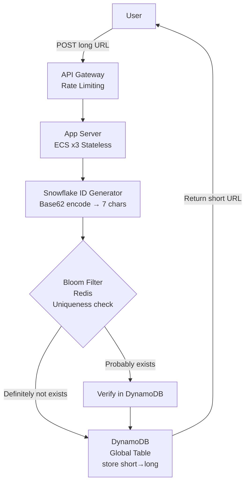
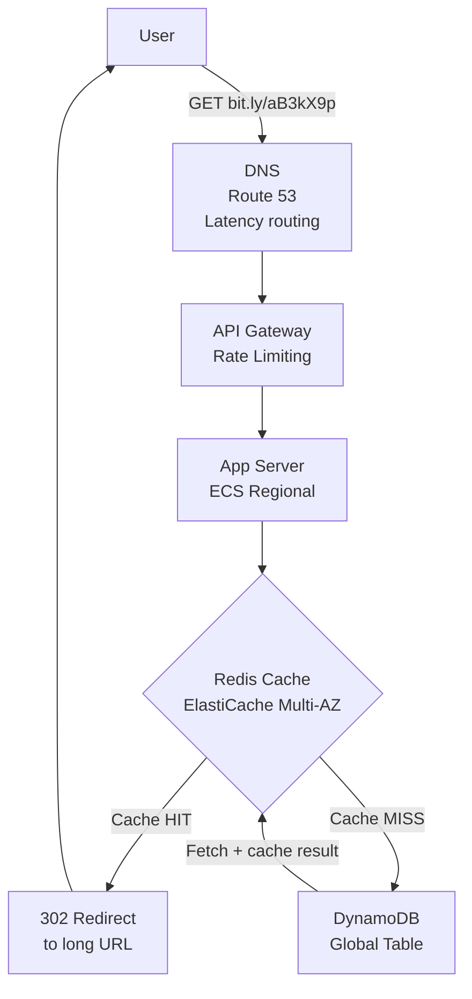

# URL Shortener





---

### How I Would Present This in an Interview

---

**Step 1 — Clarify Requirements**

Before touching any component, I ask the interviewer:

*Functional requirements:*

- User submits a long URL and gets a short URL back
- User visits the short URL and gets redirected to the original long URL
- Short URLs should be unique
- If the same long URL is submitted twice, generate a new short URL each time

*Non-functional requirements:*

- High availability — redirects must never fail
- Low latency — redirects should be near-instant
- 100 million URLs created per day, 10:1 read-to-write ratio
- URLs do not expire

---

**Step 2 — Estimation**

I always do estimation before drawing anything — the numbers justify every component choice.

- Writes: 100 million/day ÷ 100,000 seconds/day = **~1,000 writes/sec**
- Reads: 1,000 × 10 = **~10,000 reads/sec**
- Storage: 100M records/day × 500 bytes × 365 days × 5 years ≈ **~100TB**

*What these numbers tell me:*

- 1,000 writes/sec is manageable — I don't need extreme write infrastructure
- 10,000 reads/sec is significant — a cache will dramatically reduce database load
- 100TB rules out a single database — I need distributed storage like DynamoDB

---

**Step 3 — Flow 1: Create Short URL**

```
User → API Gateway → App Server (ECS, 3 instances)
                          ↓
                  Generate Snowflake ID
                  → Base62 encode → 7-character short URL
                          ↓
                  Bloom Filter (Redis) — check uniqueness
                          ↓
                  DynamoDB (Global Table)
                  Write: short_url → long_url
                          ↓
                  Return short URL to user
```

*Why each component:*

**API Gateway** — handles rate limiting so no single user can create millions of URLs and overwhelm the system. Also the single entry point for all requests.

**ECS with 3 instances** — stateless app servers. Stateless means any server can handle any request — no session data stored locally. This enables horizontal scaling. If traffic grows, I add more instances.

**Snowflake ID + Base62 encoding** — I need a unique short ID for every URL. Snowflake generates a unique 64-bit number using timestamp + machine ID + sequence number. No two servers ever generate the same ID even at 4,096 IDs per millisecond per machine. I then Base62 encode it (a-z, A-Z, 0-9) to get a 7-character URL-safe string. 62^7 = 3.5 trillion combinations — enough for decades.

**Bloom Filter (Redis)** — before writing to DynamoDB, I check if this short ID already exists. Bloom Filter answers "definitely not exists" in microseconds without hitting the database. If it says "probably exists" I verify with DynamoDB. This eliminates most unnecessary database lookups.

**DynamoDB** — the access pattern is pure key-value: give me the long URL for this short URL. No joins, no complex queries. DynamoDB is built exactly for this — handles 100TB+ with automatic sharding and global replication.

---

**Step 4 — Flow 2: Redirect (Read)**

```
User → DNS (Route 53, latency-based routing)
     → API Gateway (rate limiting)
     → App Server (ECS, nearest region)
           ↓
     Check Redis Cache (ElastiCache Multi-AZ)
     ├── Cache HIT  → 302 redirect to long URL immediately
     └── Cache MISS → query DynamoDB → cache result → 302 redirect
```

*Why each component:*

**Route 53 with latency-based routing** — a user in Mumbai should not hit a server in US-East. Route 53 automatically routes each user to the nearest healthy region. This reduces latency from hundreds of milliseconds to single digits.

**Redis Cache (ElastiCache Multi-AZ)** — popular short URLs get clicked thousands of times. Without a cache, every redirect hits DynamoDB. With Redis, the top 1% of URLs that get 80% of traffic are served from memory in microseconds. Cache-aside strategy: check Redis first, on miss fetch from DynamoDB and populate cache.

Multi-AZ means Redis has a replica in a second availability zone. If the primary fails, the replica is promoted automatically in under a minute. No data loss, no manual intervention.

**Why 302 and not 301?** 301 is a permanent redirect — the browser caches it and never hits our servers again. This saves server load but kills analytics. 302 is temporary — browser always hits our server before redirecting. This lets us log every click: who clicked, when, from which country, which device. For a URL shortener where analytics is a core feature, 302 is the right choice.

---

**Step 5 — Handling Scale and Failures**

*What if Redis goes down?*

System degrades gracefully — requests fall through to DynamoDB. Users experience slightly higher latency but service never stops. ElastiCache Multi-AZ minimizes the chance of Redis going down entirely.

*What if a DynamoDB region goes down?*

DynamoDB Global Tables automatically replicate to multiple regions. Route 53 health checks detect the failure and reroute traffic to a healthy region within seconds.

*What if traffic spikes 10x suddenly?*

ECS Auto Scaling adds new app server instances automatically based on CPU and request metrics. DynamoDB scales read and write capacity on demand with no manual intervention.

---

**Key Decisions Summary**

| Decision | Choice | Why |
| --- | --- | --- |
| Database | DynamoDB | Pure key-value, no joins, handles 100TB+ automatically |
| Cache | Redis (ElastiCache Multi-AZ) | 10,000 reads/sec — cache hit rate will be very high |
| ID generation | Snowflake + Base62 | Unique across servers, time-ordered, 7 chars |
| Redirect code | 302 | Enables click analytics — every redirect hits our servers |
| Multi-region | Route 53 latency routing | Low latency for global users |
| Uniqueness check | Bloom Filter (Redis) | Fast O(1) check before any database call |

---

**Estimation Summary**

| Metric | Value |
| --- | --- |
| Writes/sec | ~1,000 |
| Reads/sec | ~10,000 |
| Storage (5 years) | ~100TB |
| Short URL length | 7 characters (Base62) |
| Max combinations | 3.5 trillion |

---